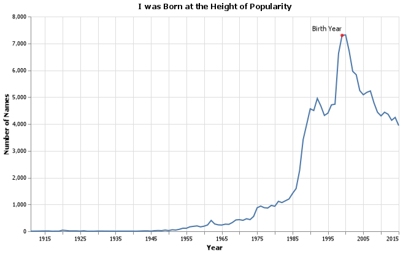

# Week 2-3 What Is In a Name

Cameron Hansen 

## Elevator pitch

*What is In a Name* is an analysis of baby names using the [data world baby names by states](https://data.world/government/us-baby-names-by-state). With the assistance of the Altair package, this analysis created several clean-looking charts, chart descriptions, and short answers to the following questions:

1. Mary, Martha, Peter, and Paul are all Christian names. From 1920 - 2000, compare the name usage of each of them.

2. How does your name at your birth year compare to its use historically?

3. If you talked to someone named Brittany on the phone, what is your guess of their age? What ages would you not guess?

4. Think of a unique name from a famous movie.  Plot that name and see how increases line up with the movie release.

## TECHNICAL DETAILS

This chart is an analysis of my name 'Cameron' used from 1910 to 2015. This graphic shows that I was born really at the peak of its usage. 

Using the standard deviation of the year from a filtered dataset, I derived that most of the people named Brittany ranged from 16-43 years old. 

Looking at this line graph, we can see peaks in its usage. The dates are similar to some of the American wars. This graph overlays the two to see if there is any correlation. 

The name 'Dorothy' from Wizard of Oz. The release of the movies seem to have no relation to the popularity in the name. 

#### How does your name at your birth year compare to its use historically?
  
I was born at the height of popularity. There is a reason why I have met so many Camerons in my life around my age. 

#### If you talked to someone named Brittany on the phone, what is your guess of their age? What ages would you not guess?

The name Brittany, according to this dataset, has only been used from 1968-2015. Of that period, it was popular from 1978-2005. If I were to guess what age she is, given the year is 2021, her age is most likely between 43 and 16 years old. Due to the absence of the name from  1968, she couldn't be older than 51. 

#### Mary, Martha, Peter, and Paul are all Christian names. From 1920 - 2000, compare the name usage of each of them.

I noticed in the naming of Christian names that they go through similar troughs and peaks even though their scale is different. After looking at the original graphic, the peaks corresponded to the beginnings or ends of American wars. The graph shows that it accounts for some of these peaks, but not all of them. Since the Cold War covers so many years, it's hard to define its impact on Christian names. With those observations, I would be interested to see if there is a correlation between the two. 

### Think of a unique name from a famous movie. Plot that name and see how increases line up with the movie release.

After thinking of early influential movies, I came to conclusion that  Wizard of Oz mightbe one of those movies I remembering it being one of the first wide released films in color.  The  main characters name is Dorothy, so I wanted to see if there was a connection. 

I would think that a historical film would have a major influence, but the opposite is true. The movie is influence by the popularity in the name there is a small peak or two before the rerelease.  

...

## APPENDIX A (PYTHON SCRIPT)

@import "week2-3.py" {cmd="python"}