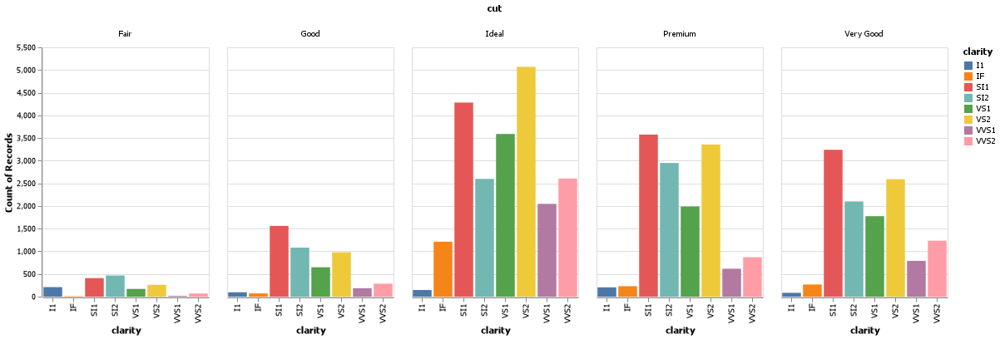

# Week 1 Introduction

Cameron Hansen 

## Elevator pitch

The Introduction week is where the class is getting all our environments set up, so the following document is proof that the setup was successful and the readings are completed. The provided Altair chart and Python script were used in note-taking during the readings.

## TECHNICAL DETAILS

The following chart is of the diamonds dataset. Using the various methods discussed in the readings this shows the number of records for each of the cuts seperated by clarity. Clarity is also color coded in the plot.dogs reate a python script and use VS Code to create the example Altair chart in the assigned readings (note that you have to type chart to see the Altair chart after you run the code). Save your Altair chart for submission.

### 1. Finish the readings and come to class prepared with any questions to get your environment working smoothly.

### 2. Create a python script and use VS Code to create the example Altair chart in the assigned readings (note that you have to type chart to see the Altair chart after you run the code). Save your Altair chart for submission.

## APPENDIX A (PYTHON SCRIPT)

@import "Week1.py" {cmd="python"}